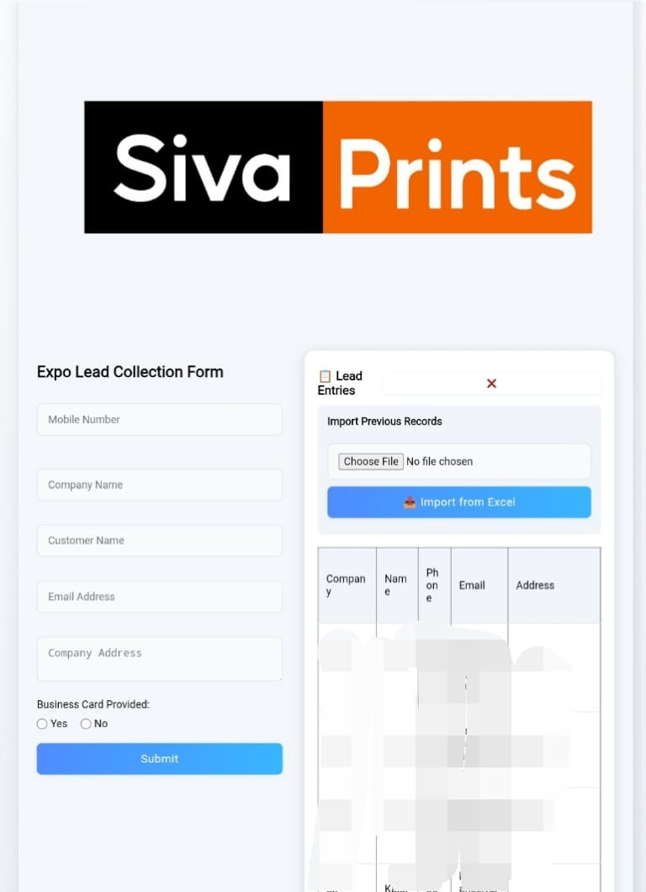

# Expo Lead Collector PWA




A secure and offline-first Progressive Web App (PWA) designed to help businesses at trade shows and events capture and manage customer leads efficiently. Built with Vanilla JavaScript and a full Firebase backend.

---

## 🌟 Key Features

*   **Secure User Authentication:** Full user login system using Firebase Authentication, protecting all data access.
*   **Offline First Functionality:** Using PouchDB and a Service Worker, the app is fully functional without an internet connection. Leads are saved locally and synced automatically to the cloud when a connection is restored.
*   **Real-time Data Validation:** Instantly checks for duplicate phone numbers against the Firestore database to prevent re-entering existing customers.
*   **Dynamic Form Autofill:** When an existing customer's number is entered, the form automatically populates with their known data for quick updates.
*   **Comprehensive Data Management:** An admin panel for viewing, paginating through records, and importing/exporting all leads to **PDF** or **XLSX (Excel)** formats.
*   **Secure Database:** Firestore Rules are implemented to ensure only authenticated users can read or write to the database.

---

## 🛠️ Tech Stack

*   **Frontend:** Vanilla JavaScript (ES6 Modules), HTML5, CSS3
*   **Backend & Database:** Google Firebase (Firestore, Firebase Authentication)
*   **Offline Storage:** PouchDB
*   **PWA Core:** Service Workers & Web App Manifest
*   **Libraries:** jspdf, SheetJS (for XLSX export)

---

## 🚀 Getting Started

To run this project locally, follow these steps:

1.  **Clone the repository:**
    ```bash
    git clone https://github.com/YOUR_USERNAME/expo-lead-collector-pwa.git
    cd expo-lead-collector-pwa
    ```

2.  **Set up your Firebase project:**
    *   Create a new project at the [Firebase Console](https://console.firebase.google.com/).
    *   Enable **Firestore Database** and **Firebase Authentication** (with Email/Password provider).
    *   Create a user in the Authentication tab (e.g., `admin@yourapp.com`).
    *   Create the necessary composite index in Firestore for querying by `phone` and ordering by `date`.

3.  **Configure your API keys:**
    *   Rename the `firebase-config.example.js` file to `firebase-config.js`.
    *   Open `firebase-config.js` and fill in your actual Firebase project configuration values. This file is intentionally not tracked by Git for security.

4.  **Run the application:**
    *   You need a simple local server to handle the modules correctly. You can use the `Live Server` extension in VS Code or run a simple server with Python:
    ```bash
    python -m http.server
    ```
    *   Open your browser and navigate to `http://localhost:8000`.
